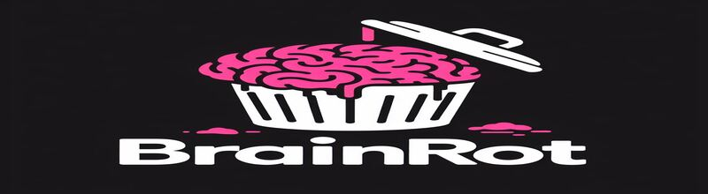

# **BRAINROT 🧠🗑️**

  

## About

Welcome to Brainrot, a mind-bending visual experience that induces a state of pure cognitive chaos. Immerse yourself in our unique brainrot animation that challenges perception and explores the boundaries of visual abstraction.

## Technologies

- **Brainwave Tech**: Unleash the power of cutting-edge brainwave technology.
- **NeuroVis Framework**: Explore visuals created with our advanced NeuroVis framework.

## Usage

Embark on a journey through the depths of insanity with our Brainrot animation. Push the limits of your mind and experience a visual adventure like never before. [BRAINROT](https://ffuv.github.io/BRAINROT)

## Contributing 🧑‍💻

Want to contribute to Brainrot? Here's how you can get involved:

1. Fork the repository.
2. Create a new branch.
3. Make your changes.
4. Open a pull request.

We welcome contributions from the community to enhance and expand the Brainrot experience.

## -License- 📃
 
This project is licensed under the [MIT License](LICENSE) - see the [LICENSE](LICENSE) file for details.

## Contacts📞

Feel free to reach out if you have any questions or suggestions:

- **Email**: Muusyinc@gmail.com
- **Twitter**: [@BenadrylYum](https://twitter.com/BenadrylYum)
- **GUNS.LOL**: [FREAKS](https://guns.lol/freaks)
